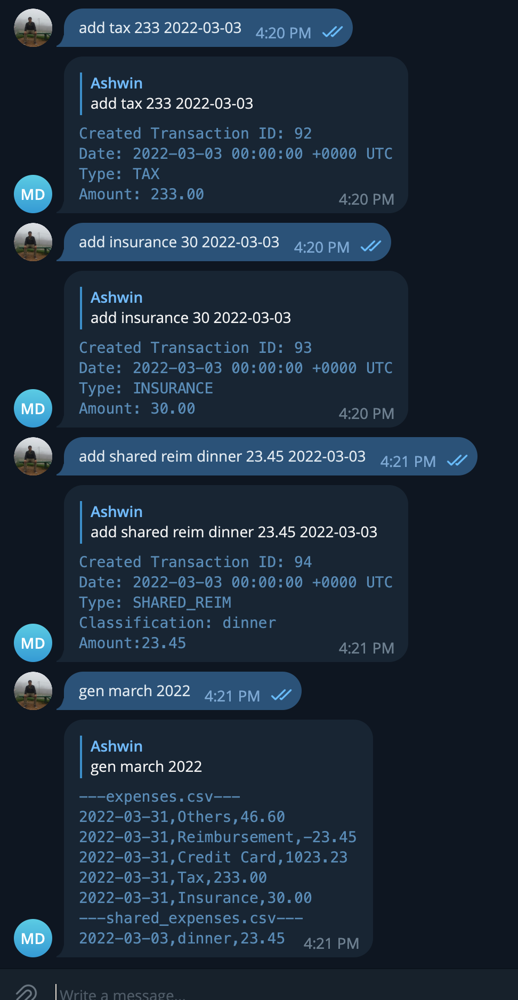

# Money Tracker Telegram

## Introduction

To account for everyday spending, I have been writing into my saved messages and parsing them every month. This is extremely tedious. The aim here is to write a small parser to understand how I spend, and to be consumed by [Financials](https://github.com/ashwinath/financials).

## Telegram API Definition

### Help

Typing `help` or any unknown command will return the help interface.

### Types

Type | Explanation
-----|------------
reim | Amount to be reimbursed, usually paying first using CC and friends paying back later.
shared reim | Amount to be reimbursed, usually paying first using CC and taking from shared account.
special shared reim | Amount to be reimbursed, usually paying first using CC and taking from shared account, not counting into regular spend.
shared | Amount that is shared but other party had paid first.
special shared | Amount that is shared but other party had paid first and it's a one off thing.
own | Regular type of spending for ownself.
special own | Amount that is spent for myself but special events.
tithe | Amount given to parents.
cc | Amount paid using credit card.
tax | Amount paid to the tax man.
insurance | Amount spent for insurance.

### Classification

Classification could be any string field. This is for your own note taking and not used in a special way.

Class | Explanation
------|------------
meal | Amount spent on meals.
housing | Amount spent on housing needs.
whatever you want | whatever description you give it

### Adding a transaction

User: ADD <TYPE> <CLASSIFICATION> <PRICE (no $ sign)> <Optional date (will automatically fix to yyyy-mm-dd)>
Service returns: ```
Created Transaction ID: 5
Date: 2023-04-02 14:14:48 +0800 +08
Type: OWN
Classification: hellowyellow
Amount:123.200000
```

### Deleting a transaction

User: DEL <ID>
Service returns: ```
Deleted Transaction ID: 5
Date: 2023-04-02 14:14:48 +0800 +08
Type: OWN
Classification: hellowyellow
Amount:123.200000
```

### Generating a report by month

User: GEN APR 2023
Service returns: 
```
---expenses.csv---
2023-04-30,Others,23.40
2023-04-30,Reimbursement,-46.80
2023-04-30,Insurance,200.54
2023-04-30,Tithe,200.32
2023-04-30,Credit Card,23.40
2023-04-30,Tax,23.40
---shared_expenses.csv---
2023-04-03,table,223.20
2023-04-04,Special:furniture,200.20
```

## Web scraping (internal network only)

All formats here adhere to the types used by [Financials](https://github.com/ashwinath/financials).

```
GET /expenses?month=<2 digit month>&year=<4 digit year>
GET /shared-expenses?month=<2 digit month>&year=<4 digit year>

Both API returns

{
    "expenses": [
        {
            "date": <date in ISO 8601>,
            "type": <type>,
            "amount": <float64 number>
        }
    ]
}

```

## Screenshots


